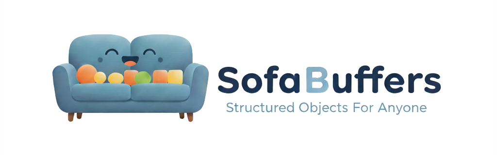

<p align="center"></p>

# SofaBuffers

<b>Structured Objects For Anyone</b><br>
<i>... so optimized, feels amazing.</i>

[Would you like to know more?](https://github.com/sofa-buffers)

---

## SofaBuffers Code Generator

This repository holds the **SofaBuffers code generator** — the tool that turns a
declarative **YAML/JSON object definition** (validated against
[`schema/sofabuffers-schema-v1.json`](schema/sofabuffers-schema-v1.json)) into
**idiomatic, typed source code** for every supported language. The generated code
is a thin, zero-overhead wrapper that calls into the highly-optimized **corelib**
runtime for its language, so the hard part — a fast, portable, footprint-tuned
wire codec with a uniform streaming API — is owned by the corelibs, not the
generated code.

The generator (`sofabgen`) emits typed code for **C, Go, Python, TypeScript,
C++, Rust, C#, Java, and Zig**. Every backend is built against its real corelib,
JSON round-trips every field kind, and is byte-exact against the shared wire
vectors — so code generated for one language interoperates with any other.

## Quick start

```sh
# Grab a prebuilt binary from the latest release, or build from source:
go build -o sofabgen ./cmd/sofabgen

# Generate typed sources for one language from a definition.
./sofabgen --lang go --in examples/messages/example.yaml --out out/go

# Generate for every language.
for lang in c cpp go python typescript rust csharp java zig; do
  ./sofabgen --lang "$lang" --in examples/messages/example.yaml --out "out/$lang"
done

# Render the definitions as a self-contained HTML reference page instead:
./sofabgen --lang docs --in examples/messages/example.yaml --out out/docs

# Scaffold a full buildable project + encode/decode harness:
#   sofabgen --config myconfig.yaml --lang rust --in examples --out out
```

Prebuilt static binaries for Linux, Windows and macOS (x86 and ARM, 32- and
64-bit) are attached to every
[release](https://github.com/sofa-buffers/generator/releases).

Examples:
- [`examples/messages/example.yaml`](examples/messages/example.yaml) — a showcase exercising every
  field kind.
- [`examples/messages/realworld/`](examples/messages/realworld/) — a realistic connected-vehicle
  telemetry schema split across **multiple files** with cross-file `$ref`.

Each backend has a one-command conformance harness at
`tests/conformance/<lang>/run.sh` that generates the example, builds it against the
real corelib, and round-trips it.

The "minimal-footprint vs. maximum-throughput" claim below is measured, not
asserted: [`tests/bench/`](tests/bench/) records instructions/op and embedded
`.text` for every (language × corelib) combination in a committed `results.txt`, so
a codegen change that costs or saves shows up as a diff.

### What it does

1. Reads an **object/message definition** in YAML (JSON also accepted).
2. **Validates it against the JSON Schema first** — a hard, non-optional gate.
   Invalid input produces a clear, located error, a non-zero exit, and **no
   output**. Invalid definitions are never code-generated.
3. Resolves `$ref` into a shared-type graph and lowers the definition into a
   language-neutral **Intermediate Representation (IR)**.
4. Emits **one typed `serialize`/`deserialize` type per object** for the selected
   target language, tuned to that corelib's profile (minimal-footprint vs.
   maximum-throughput).
5. Ships as a **single, statically-linked, cross-platform binary** (`sofabgen`).

### Supported targets

The generator emits code against one corelib per language:

| Target | Corelib | Profile |
|---|---|---|
| C (`object.h`) | `corelib-c-cpp` | Embedded, minimal footprint, no heap |
| C++ (embedded) | `corelib-c-cpp` (`sofab.hpp`) | Embedded friendly |
| C++ (max speed) | `corelib-cpp` | Max speed, zero-copy decode |
| Rust (`no_std`) | `corelib-rs-no-std` | Embedded, no `alloc` by default |
| Rust (std) | `corelib-rs` | Max speed |
| Go | `corelib-go` | Max speed |
| Python | `corelib-py` | Max speed |
| Java | `corelib-java` | Max speed |
| C# / .NET | `corelib-cs` | Max speed |
| TypeScript | `corelib-ts` | Max speed |
| Zig | `corelib-zig` | Max speed, zero-copy decode |

Because every corelib speaks the **same wire format**, code generated for one
language interoperates with code generated for any other for free.

Beyond the language backends there is one non-code target: `docs` renders the
definitions as a **self-contained HTML reference page** (messages, field
tables, cross-linked named types — see
[docs/generator/docs.md](docs/generator/docs.md)).

### CLI

The CLI is deliberately tiny — everything configurable lives in a config file:

```sh
sofabgen --config <file> --lang <c|cpp|rust|go|python|java|csharp|typescript|zig|docs> \
        [--in <dir>] [--out <dir>]
```

| Argument | Required | Purpose |
|---|---|---|
| `--config <file>` | yes | YAML/JSON config carrying all other options |
| `--lang <target>` | yes | Which backend to generate |
| `--in <dir>` | no | Override the config's input definition folder |
| `--out <dir>` | no | Override the config's output folder |

## Repository layout

```
.
├── cmd/sofabgen/        # the `sofabgen` CLI entry point
├── generators/        # one backend per target (c, cpp, rust, golang, python, java, csharp, typescript, zig, docs)
├── internal/          # parser, validator, IR, analysis, generation pipeline
├── schema/            # the message-definition JSON Schema (draft-07)
├── examples/          # example definitions (config/ + messages/)
├── tests/             # conformance harnesses, the hermetic matrix, and bench/ (Ir/op + footprint)
├── docs/              # architecture & design
├── assets/            # logo & icon
├── .devcontainer/     # dev container: Go + the conformance-harness toolchains
└── LICENSE            # MIT
```

The definition schema (`schema/sofabuffers-schema-v1.json`) is authoritative for
the input format: field types (`u8`–`u64`, `i8`–`i64`, `fp32`/`fp64`, `boolean`,
`string`, `blob`, `array`, `enum`, `bitfield`, `struct`, `union`), unique field
ids, `$ref`-able `$defs`, and the custom keywords `uniqueIds` and
`defaultMatchesEnum`.

## Development

A `.devcontainer` (Ubuntu 26.04 + Go, plus the toolchains the per-language
conformance harnesses shell out to: C/C++, Zig, Rust, Java/Maven, .NET, Python,
Node) is provided. To use it locally, copy the secrets template first (the real
`.env` is gitignored):

```sh
cp .devcontainer/.env.example .devcontainer/.env
```

Then open the folder in a devcontainer-aware editor, or build the image directly
via the scripts under `.devcontainer/`. The generator is written in **Go** — a
single static binary with frictionless `GOOS`/`GOARCH` cross-compilation.

## Documentation

- **[`docs/ARCHITECTURE.md`](docs/ARCHITECTURE.md)** — how the generator is
  structured: the parser → validator → IR → backend pipeline, the per-corelib
  decode models, and the design patterns (Composite / Visitor / Builder /
  Strategy) that hold it together.
- **[`docs/PLAN.md`](docs/PLAN.md)** — the design rationale: input format, corelib
  runtime contract, generated-code shape, optimization strategy, and
  configuration.
